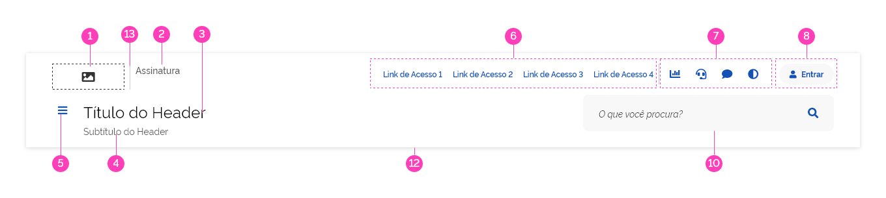
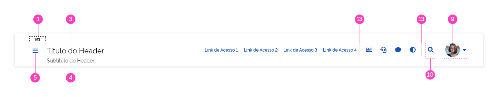
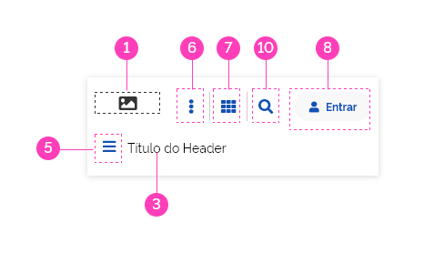
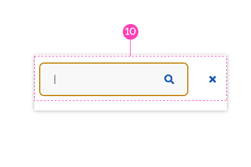
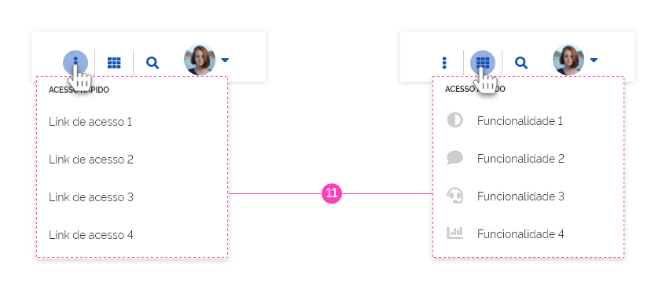
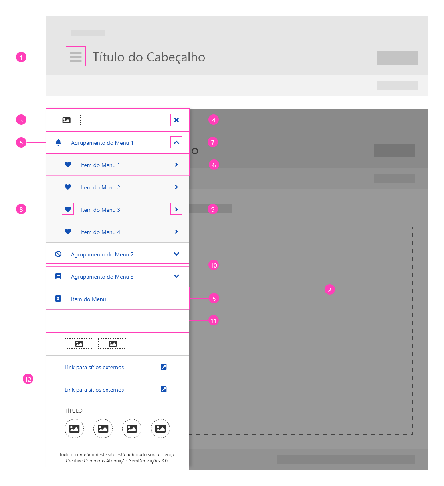
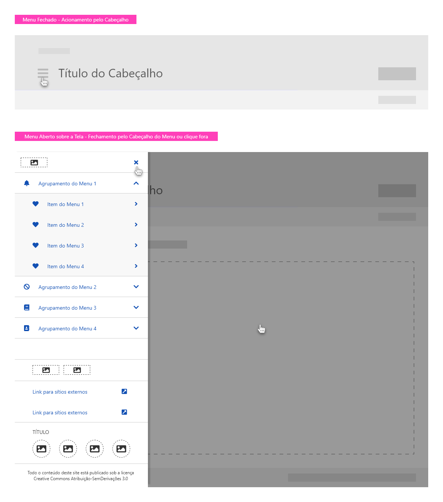
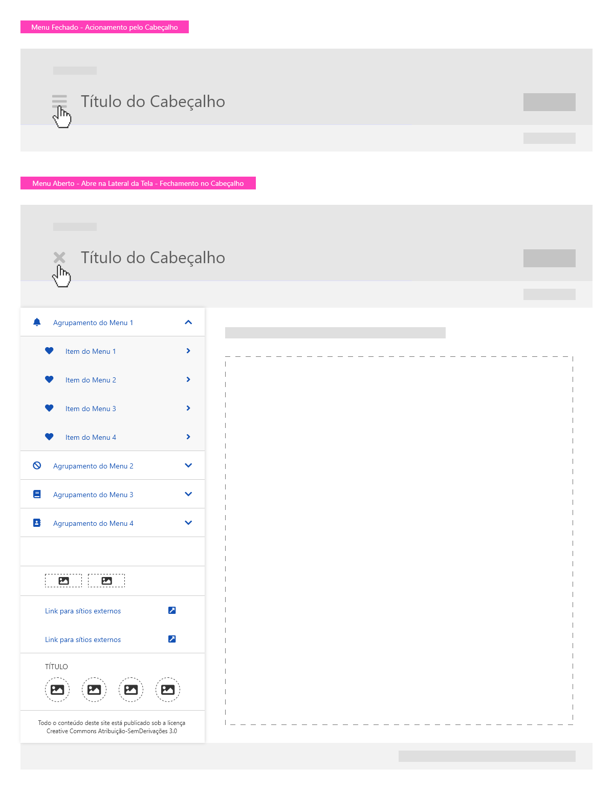
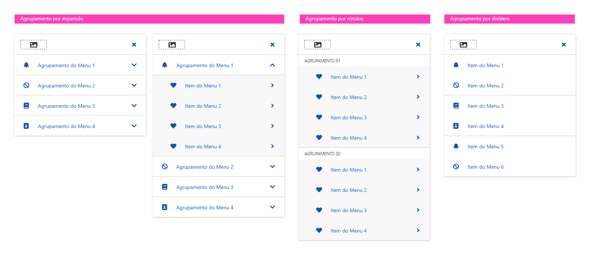
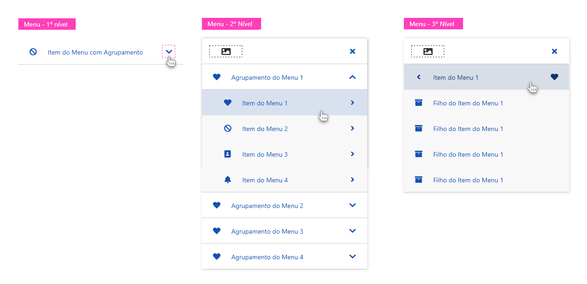

# Django DSGovBR

[](https://badge.fury.io/py/django-dsgovbr)
[](https://pypi.org/project/django-dsgovbr/)
[](https://www.djangoproject.com/)
[](https://opensource.org/licenses/MIT)

Pacote Django para adoção do [Design System do Governo Federal Brasileiro (DS Gov.BR)](https://www.gov.br/ds/home) em
sites e painel de administração Django.

## 📋 Sobre

O **django-dsgovbr** facilita a implementação do Design System oficial do Governo Federal em projetos Django,
inclusive no Django Admin, garantindo conformidade visual e de usabilidade com os padrões estabelecidos pelo gov.br.

### 🎨 Design System Gov.BR

O [DS Gov.BR](https://www.gov.br/ds/home) é o design system oficial do Governo Federal Brasileiro, criado para
padronizar a experiência do usuário em todos os portais e sistemas governamentais.

**Links Oficiais:**

- 🏠 [Site Oficial](https://www.gov.br/ds/home)
- 📚 [Documentação](https://www.gov.br/ds/fundamentos-visuais/visao-geral)
- 🎨 [Fundamentos Visuais](https://www.gov.br/ds/fundamentos-visuais/introducao)
- 🧩 [Componentes](https://www.gov.br/ds/componentes/overview)
- 📐 [Padrões](https://www.gov.br/ds/padroes/introducao)
- 💾 [Download dos Assets](https://www.gov.br/ds/recursos/downloads)

### ✨ Recursos Visuais do DS Gov.BR

O Design System inclui:

#### Partes principais

- **Header**: Cabeçalho da página
- **Content**: Área principal do conteúdo
- **Footer**: Rodapé da página (opcional).

#### Componentes principais

- **Formulários**: Inputs, selects, checkboxes, radio buttons estilizados
- **Botões**: Primários, secundários, terciários com estados hover/active/disabled
- **Mensagens**: Alertas, notificações e mensagens de sistema
- **Navegação**: Headers, breadcrumbs, menus e abas
- **Tabelas**: Grades de dados responsivas e acessíveis
- **Cards**: Cartões informativos e de conteúdo
- **Modal**: Diálogos e janelas modais
- **Paginação**: Controles de navegação entre páginas

#### Características visuais

- 🎨 **Paleta de Cores Oficial**: Azul Gov.BR (#071D41), cores de status e feedbacks
- 📱 **Design Responsivo**: Mobile-first, adaptável a todos os dispositivos
- ♿ **Acessibilidade**: WCAG 2.1 nível AA, suporte a leitores de tela
- 🔤 **Tipografia Rawline**: Fonte oficial do governo federal
- 📐 **Grid System**: Sistema de grid consistente (12 colunas)
- 🖼️ **Ícones**: Biblioteca Font Awesome 5.12 com ícones customizados

### Visual do DS Gov.BR

O design é divido em 3 partes principais: Header, Content e Footer (opcional).

#### Header

O Header pode ser do tipo padrão ou compacto. O Padrão tem 2 linhas de elementos e o Compacto tem apenas 1 ou
linha de elementos. A anatomia do Header é composta por:

| #  | Elemento                  | Padrão       | Compacto    |
|----|---------------------------|--------------|-------------|
| 1  | Logo                      | Recomendado  | Opcional    |
| 2  | Assinatura                | Opcional     | Ausente     |
| 3  | Título                    | Obrigatório  | Obrigatório |
| 4  | Subtítulo                 | Opcional     | Opcional    |
| 5  | Botão Menu                | Recomendado  | Opcional    |
| 6  | Área para links           | Opcional     | Opcional    |
| 7  | Área para funcionalidades | Opcional     | Opcional    |
| 8  | Botão autenticar          | Opcional     | Opcional    |
| 9  | Avatar do Usuário         | Opcional     | Opcional    |
| 10 | Campo de Busca            | Opcional     | Opcional    |
| 11 | Lista Dropdown            | Recomendado  | Opcional    |
| 12 | Superfície                | Obrigatório  | Obrigatório |
| 13 | Separadores               | Obrigatório  | Obrigatório |

##### Header Padrão



##### Header Compacto



##### Header Mobile inicial



##### Header Mobile ao clicar em search



##### Header Mobile nos botões agrupadores de ações (links ou funcionalidades)



##### Header Menu

O Menu pode ser do tipo flutuante (flutua sobre o conteúdo) ou fixo (empurra o conteúdo) e é constituído por:

| ID  | Nome                         | Referência  | Uso         |
|-----|------------------------------|-------------|-------------|
| 1   | Ícone de acionamento         | Button      | Opcional    |
| 2   | Superfície scrim             | —           | Condicional |
| 3   | Cabeçalho do menu            | Header      | Opcional    |
| 4   | Botão Fechar                 | Button      | Opcional    |
| 5   | Item de 1º nível             | Item        | Opcional    |
| 6   | Item de 2º nível             | Item        | Condicional |
| 7   | Ícone Expandir/Retrair       | Button      | Condicional |
| 8   | Ícone representativo do item | Iconografia | Opcional    |
| 9   | Ícone Acessar Subitens       | Button      | Condicional |
| 10  | Componente divider           | Divider     | Condicional |
| 11  | Painel do menu               | —           | Obrigatório |
| 12  | Rodapé do menu               | Footer      | Opcional    |











## 🚀 Instalação

### Via PyPI (Recomendado)

```bash
pip install django-dsgovbr
```

## ⚙️ Configuração

### 1. Adicione ao INSTALLED_APPS

```python
# settings.py

INSTALLED_APPS = [
    # Coloque antes do `django.contrib.admin` para garantir que seja que o template path prevaleça sobre os templates
    # padrões do Django.
    'dsgovbr',
    'django.contrib.admin',
    # ... suas apps
]
```

### 2. Configure os Context Processors (Opcional)

```python
# settings.py

TEMPLATES = [
    {
        'BACKEND': 'django.template.backends.django.DjangoTemplates',
        'DIRS': [],
        'APP_DIRS': True,
        'OPTIONS': {
            'context_processors': [
                # ... outros context processors
                'dsgovbr.context_processors.dsgovbr',
            ],
        },
    },
]
```

### 3. Colete os Arquivos Estáticos

```bash
python manage.py collectstatic
```

## 📖 Uso

### Templates Base

Use os templates base do DSGovBR nos seus templates Django:

```django



Minha Página Gov.BR


<div class="br-container">
    <h1>Bem-vindo ao Sistema</h1>

    <!-- Botão Primário -->
    <button class="br-button primary" type="button">
        Ação Principal
    </button>

    <!-- Mensagem de Sucesso -->
    <div class="br-message success">
        <div class="icon">
            <i class="fas fa-check-circle"></i>
        </div>
        <div class="content">
            Operação realizada com sucesso!
        </div>
    </div>

    <!-- Card -->
    <div class="br-card">
        <div class="card-header">
            <h3>Título do Card</h3>
        </div>
        <div class="card-content">
            <p>Conteúdo do card seguindo o padrão Gov.BR</p>
        </div>
    </div>
</div>

```

### Formulários Django

Os formulários Django automaticamente usam os estilos do DS Gov.BR:

```python
# forms.py
from django import forms

class MeuFormulario(forms.Form):
    nome = forms.CharField(
        label="Nome Completo",
        max_length=100,
        widget=forms.TextInput(attrs={
            'class': 'br-input',
            'placeholder': 'Digite seu nome'
        })
    )

    email = forms.EmailField(
        label="E-mail",
        widget=forms.EmailInput(attrs={
            'class': 'br-input',
            'placeholder': 'seuemail@exemplo.gov.br'
        })
    )

    mensagem = forms.CharField(
        label="Mensagem",
        widget=forms.Textarea(attrs={
            'class': 'br-textarea',
            'rows': 5
        })
    )
```

### Admin do Django

O pacote fornece templates customizados para o Django Admin com visual Gov.BR:

```python
# admin.py
from django.contrib import admin
from .models import MeuModelo

@admin.register(MeuModelo)
class MeuModeloAdmin(admin.ModelAdmin):
    list_display = ['nome', 'status', 'data_criacao']
    list_filter = ['status']
    search_fields = ['nome']
```

## 🎨 Componentes Disponíveis

### Classes CSS Principais

```html
<!-- Botões -->
<button class="br-button primary">Primário</button>
<button class="br-button secondary">Secundário</button>
<button class="br-button tertiary">Terciário</button>

<!-- Mensagens -->
<div class="br-message info">Informação</div>
<div class="br-message success">Sucesso</div>
<div class="br-message warning">Aviso</div>
<div class="br-message error">Erro</div>

<!-- Cards -->
<div class="br-card">
    <div class="card-header">Cabeçalho</div>
    <div class="card-content">Conteúdo</div>
    <div class="card-footer">Rodapé</div>
</div>

<!-- Inputs -->
<input type="text" class="br-input" placeholder="Digite aqui...">
<textarea class="br-textarea"></textarea>
<select class="br-select">
    <option>Opção 1</option>
</select>
```

## 🔧 Desenvolvimento

### Requisitos

- Python 3.10+
- Django 5.2+

### Setup para Desenvolvimento

```bash
# Clone o repositório
git clone https://github.com/kelsoncm/django-dsgovbr.git
cd django-dsgovbr

# Crie um ambiente virtual
python -m venv venv
source venv/bin/activate  # Linux/Mac
# ou
venv\Scripts\activate  # Windows

# Instale as dependências de desenvolvimento
pip install -e ".[dev]"

# Execute os testes
python -m pytest
```

## 📝 Licença

Este projeto está licenciado sob a Licença MIT - veja o arquivo [LICENSE](LICENSE) para detalhes.

## 👥 Contribuindo

Contribuições são bem-vindas! Por favor:

1. Faça um Fork do projeto
2. Crie uma branch para sua feature (`git checkout -b feature/MinhaFeature`)
3. Commit suas mudanças (`git commit -m 'Adiciona MinhaFeature'`)
4. Push para a branch (`git push origin feature/MinhaFeature`)
5. Abra um Pull Request

## 📧 Contato

Kelson da Costa Medeiros

- Email: <kelsoncm@gmail.com>
- GitHub: [@kelsoncm](https://github.com/kelsoncm)

## 🔗 Links Úteis

- [Design System Gov.BR - Site Oficial](https://www.gov.br/ds/home)
- [DS Gov.BR - Componentes](https://www.gov.br/ds/componentes/overview)
- [DS Gov.BR - GitHub](https://github.com/govbr-ds)
- [Documentação Django](https://docs.djangoproject.com/)
- [Acessibilidade Gov.BR](https://www.gov.br/governodigital/pt-br/acessibilidade-digital)

## 📊 Status do Projeto

- ✅ Integração básica com Django Admin
- ✅ Templates base Gov.BR
- ✅ Componentes CSS principais
- ✅ Suporte a formulários Django
- 🔄 Em desenvolvimento: Widgets customizados
- 📋 Planejado: Componentes JavaScript interativos

### 🚀 Próximos Passos

Planejamos adicionar nas próximas versões:

- Widgets customizados para formulários
- Componentes JavaScript interativos
- Mais templates de exemplo
- Suporte a temas customizados
- Documentação expandida

### 🙏 Agradecimentos

Agradecemos à equipe do Design System Gov.BR por criar e manter o design system oficial do governo federal brasileiro.

### 📧 Feedback

Encontrou algum problema ou tem sugestões?
Abra uma [issue](https://github.com/kelsoncm/django-admintheme-dsgovbr/issues) ou contribua com um pull request!

---

> Desenvolvido com ❤️ para o ecossistema Gov.BR
